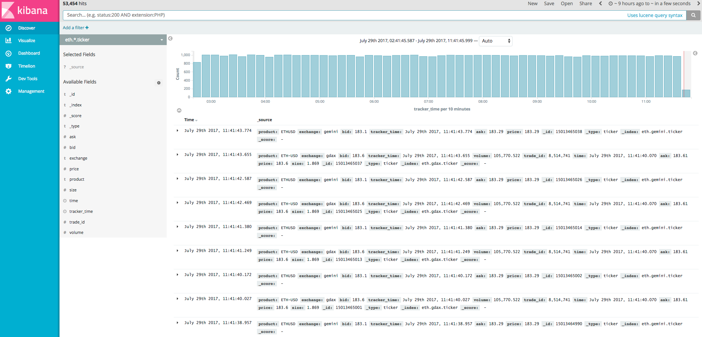

# Eth Monitor
Monitoring CryptoCurrency exchanges to collect data for the algorithmic trading analysis.

# Screenshot




# Configuration
1. Rename app/default.env to app/.env
2. Fill out timing settings in settings.py

# Testing
```js
docker-compose build
docker-compose up
```
This will launch 3 docker containers. The first two are stock images of Elastic Search and Kibana. The third being a python2.7 container containing our app which is automatically configured to run after a configurable timer. You should then be able to navigate to Kibana to see information starting to be entered into the system.

http://localhost:5601/


If this is the first time running Kibana, you need to add the following index patterns, with Time-field name being set to tracker_time:
```js
eth.*.ticker
*.*.ticker
eth.*.candle
```

 A json file containing saved objects and dashboards is provided under /resources. This file can be imported from Kibana's UI by navigating to Management->Saved Objects->Import.


# Production Settings
 On a live system, vm_map_max_count should be permanently set in /etc/sysctl.conf:
```js
 $ grep vm.max_map_count /etc/sysctl.conf
 vm.max_map_count=262144
```

# Additional Resources
Use resources/configure-kibana.sh to automatically set default indexes, and import saved objects.
